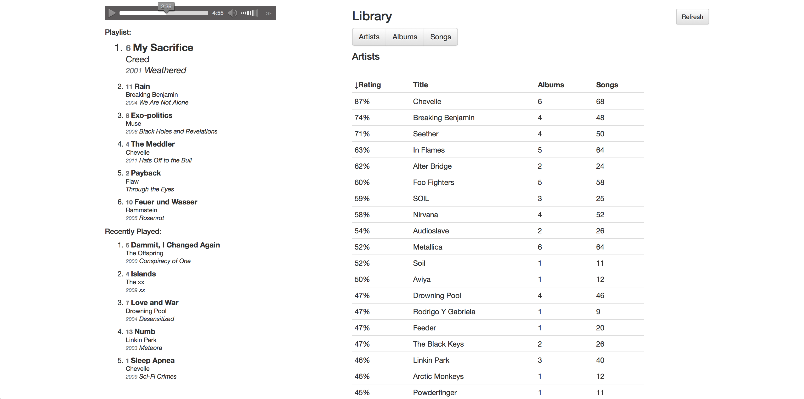

#speler
---

## Python version

Refer [python branch](https://github.com/Tjorriemorrie/speler/tree/python)

Latest version and up to date. What I'm currently developing. Just set your music path in the docker-compose file:

### PHP version

Refer [php branch](https://github.com/Tjorriemorrie/speler/tree/php)

Old and first platform I developed my music player on using Symfony2. Not sure if it even works anymore.

